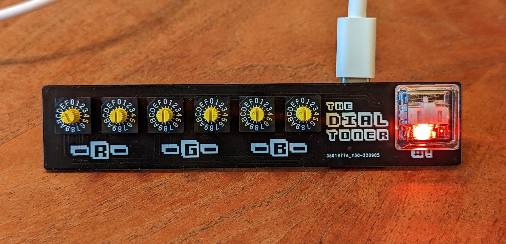

# The Dial Toner

## An Unnecessary Series of Hardware Color Pickers

### The Dial Toner (Basic)

- The original. [Available on Etsy!](https://www.etsy.com/listing/1327220837/the-dial-toner-a-tactile-mechanical)
- Find usage instructions [here](/basic).
- Dial in your color using the delightfully tactile hex switches.
- Built-in RGB LED's show the (approximate!) color you have selected in real time.
- Smash the button to send the color into your design software (or anywhere, the device acts as a keyboard).
- Can be configured to output Hex, RGB, CMYK, or HSL color.

#### Rev02 

----------

### The Dial Toner Ultra

- The "Swiss-army-knife".
- Find usage instructions [here](/ultra).
- Dial in your color using 4 analog dials. Input modes include Hex, RGB, CMYK, HSL, and P**tone.
- 1.3" LCD screen displays your color (and corresponding values) in real time.
- RGB backlit knobs because why not.
- Smash the button to send the color into your design software (or anywhere, the device acts as a keyboard).
- Can be configured to output Hex, RGB, CMYK, or HSL.

#### Rev01

