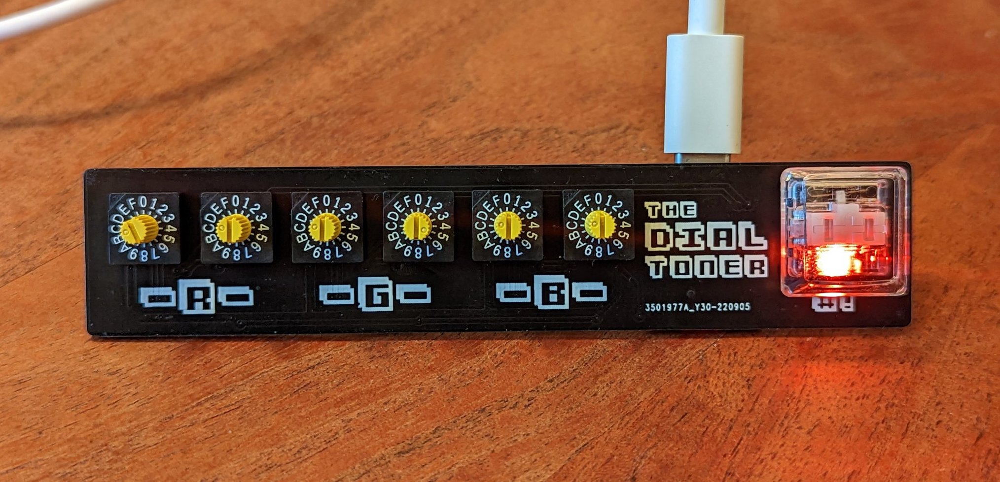

# The Dial Toner (Basic)

## General Usage
1. Connect the Dial Toner to your computer via USB.
2. Dial in a hex color using the 6 knobs. (Note - the engraved line on top of the knob points to the selected value. There is a small circuilar impression on the _left_ sign of the line.)
3. Observe that the color of the LED (roughly) matches the color you have chosen.
4. Hit the button, and observe that the dial toner types your hex code (followed by a simulated enter key press).

## Changing Configuration
1. Unplug the device.
2. Hold down the “#!” button, and plug the device back in (keep holding!).
3. Hold until you see the LED come on - if it is fading through different colors, the device is in "config" mode. You can release the button.
4. In config mode, each of the knobs corresponds to a config parameter. When you change any of them the light will start to blink, indicating that a change has been made. Hit the button again to save your selection and resume normal operation.
    
    1. **The first knob changes the color output mode**. The possible values are 0 for a hex color string, 1 for RGB (integers, 0-255), 2 for CMYK percentages (decimals), 3 for HSL percentages (decimals). Any other value defaults to hex.

    1. **The second knob changes the "whitespace" mode**. The possible values are 0 for "space" (will insert a space between each discrete value), 1 for "tabs" (will insert a tab between each discrete value, 2 for "comma" (will insert "," between...). Any other value defaults to "space". Tabs are particularly useful when you want to fill multiple input fields in one go. Note - this setting does not affect hex color strings. 

    1. **The third knob sets whether or not to hit a simulated "enter" key after the color value is typed**. 0 will not append enter, 1 will append enter. Any other value defaults to 1 (append enter).

    1. **The fourth knob dials in LED brightness**. 0-F on the knob dials in the brightness percentage from ~0-80% (anything brighter is a bit much). Keep in mind - if you turn the brightness to 0, you will not see the light anymore! Probably a stupid feature, but somebody suggested that it might be fun to play a game where you pick a color and see how close you can dial it in without seeing it. 

    1. **The fifth knob changes the keyboard layout**. The possible values are 0 for United States English, 1 for British English (switches '#' and '£'), and 2 for "International" (should work for most other layouts). Any other selected value defaults to "US".

## Changing/Updating the Firmware:
- This device runs [CircuitPython](https://circuitpython.org/). It’s a really great way to get started with embedded software development. All of the code that powers this device is available on the device for you to play around with. 

- To change/update/check the firmware, you should boot up the device in Debug mode:
    1. Unplug the device
    2. Hold down the button, and plug the device back in (keep holding!).
    3. Wait until you see the LED come on and start cycling through colors (keep holding!).
    4. Unplug the device again.
    5. Keep holding the button down, plug in the device again.
    6. When the LED comes back on, the device should be in normal usage mode, but the storage drive should now be enabled! There should be a drive called CIRCUITPY mounted on your computer.

- To see which version of the firmware you are running, boot up in debug mode (described above), and check the file called `version.txt` on the CIRCUITPY drive. If there is no `version.txt` file, you are likely running version 0.0.1.

- "Official" firmware releases can be found [here](https://github.com/dupontgu/dial_toner/releases/). Find the latest release, and follow the link to the release's artifacts. Download the `DT Basic Bundle` zip file. Extract all of the files from the zip archive and copy them onto the CIRCUITPY drive. **Replace all existing files**. Once copying has finished the device will reboot and will be running the updated code.

- If you want the device to stay in Debug mode, so the files are available every time you reboot (without holding the button down):
    1. Boot the device in Debug mode as described above.
    1. Locate the file called ‘boot.py’ on the CIRCUITPY drive.
    1. Open it in a text editor. (If you don’t have a coding-oriented text editor installed, use something lightweight like TextEdit or Notepad. It’s best not to use a document editor like Microsoft Word)
    1. Change the line that says “DEBUG = False” to say “DEBUG = True”.
    1. Save the boot.py file.
    1. Reboot the device - it should stay in Debug mode as long as “DEBUG = True”.

- You can [change the name](https://learn.adafruit.com/welcome-to-circuitpython/renaming-circuitpy) of the `CIRCUITPY` drive if you want to.

