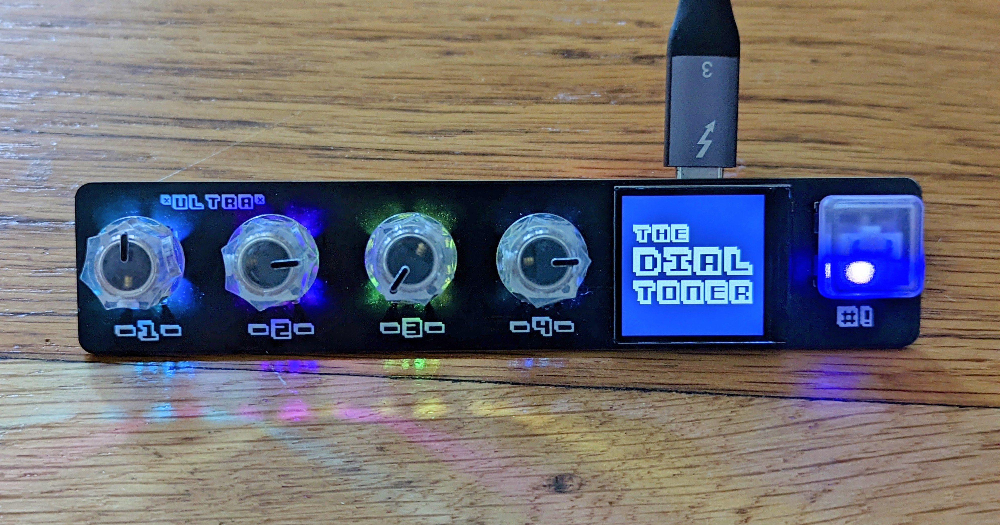

# The Dial Toner (Ultra)



## General Usage
1. Connect the Dial Toner to your computer via USB.
2. Dial in a color using the 4 knobs. (Each knob will change a different characteristic of the color, depending on which input mode is currently selected. Only knobs with backlights on are active)
3. The text on the LCD screen will display the color's characteristics as you turn the knobs, and the background of the LCD will display the currently selected color.
4. Press and release the button, and observe that the Dial Toner types the selected color value on your computer.

------------

## Changing Configuration
1. To enter config mode, hold the button down for approxmiately 3 seconds. The lights on the board will start to blink once you are in config mode.
2. Once in config mode, the first two knobs can be used to change your settings. The first knob selects the config parameter to be changed. The second knob changes the value of the currently selected parameter.

### Config Parameters

1. **Input Mode, aka `MODE`** - Selects the input mode (colorspace) of the Dial Toner. This determines what each of the knobs does during normal operation.

    **Possible Values:**

    1. `HEX` - The knobs will be used to dial in a hexadecimal, 24-bit RGB color value. Knob 1 will adjust the `red` component, knob 2 will adjust the `green` component, knob 3 will adjust the `blue` component, and knob 4 will be inactive. Each component will be a discrete value between 0x00 and 0xFF. 

    1. `RGB` - The knobs will be used to dial in a 24-bit RGB color value. Knob 1 will adjust the `red` component, knob 2 will adjust the `green` component, knob 3 will adjust the `blue` component, and knob 4 will be inactive. Each component will be a discrete value between 0 and 255. (This is effectively the same as `HEX` mode - only the display is different).

    1. `CMYK` - The knobs will be used to dial in a CMYK color value. Knob 1 will adjust the `cyan` component, knob 2 will adjust the `magenta` component, knob 3 will adjust the `yellow` component, and knob 4 will adjust the `key` component. Each component will be a percentage between 0.0% and 100.0%.

    1. `P-TONE` - The knobs will be used to select a color ID from a certain, well-known ["color matching system"](https://www.pantone-colours.com/). Rhymes with schman-tone. Knob 1 will choose the thousand's digit (0,xxx - 9,xxx) of the ID, knob 2 will choose the hundred's digit (x,0xx - x,9xx), knob 3 will choose the tens's digit (x,x0x - x,x9x), and knob 4 will choose the one's digit (x,xx0, x,xx9). Note that not every number between 0-9999 is present, so the values might jump around a bit. 

    1. `HSL` - The knobs will be used to dial in n HSL. Knob 1 will adjust the `hue` component, knob 2 will adjust the `saturation` component, knob 3 will adjust the `lightness` component, and knob 4 will be inactive. The `hue` value will be an integer between 0 and 359. The `lightness` and `saturation` values will be percentages between 0.0% and 100%.

1. **Button LED Brightness, aka `BTN BRT`** - Adjusts the brightness of the RGB LEDs beneath the button and behind the board. Values are between 0% and 90%. Note that if you choose 0%, the LEDs will be off.

1. **Output Mode, aka `OUTPUT`** - Selects the output mode of the Dial Toner. This determines how the color will be typed out when you hit the button.

    **Possible Values:**

    1. `HEX` - The selected color will be typed out as a 6-digit hexadecimal RGB color, preceded by a `#` symbol. 
    For example: ```#FF4400```

    1. `RGB` - The selected color will be typed out as 3 discrete 8-bit integers. One for `red`, one for `green`, and one for `blue`. They will be separated by commas. 
    For example: ```255, 127, 0```

    1. `CMYK` - The selected color will be typed out as 4 floating point values between 0.0 and 1.0. The first for the `cyan` component, the second for `magenta`, the third for `yellow`, and the fourth for `key`. They will be separated by commas. 
    For example: ```0.334, 1.0, 0.5789229, 0.0```

    1. `HSL` - The selected color will be typed as 3 numbers: an integer (0-359) representing the `hue` component of the color, a floating point percentage value (0.0-1.0) representing the `saturation` level of the color, and another percentage representing the `lightness` of the color. They will be separated by commas.
    For example: ```255, 0.444, 1.0```

1. **Keyboard Layout aka `KEYBRD`** - Selects the regional keyboard layout that the Dial Toner will adhere to. It should match the keyboard layout that your computer is expecting. It ensures that the `#` key is typed correctly when the output mode is set to the `HEX`. The values are `US` for United States English, `UK` for British English, and `INTL` for everything else. (Forgive me for reducing everyone else to "international", but it seems like most other layouts treat the `#` the same way.)

1. **Append Key aka `APPEND`** - Determines whether or not the Dial Toner should append a key press when it is finished typing out a color value. Values are `ENTER` for a simulated `enter` (return) key press, and `NONE` for no additional key presses. Selecting `ENTER` might come in handy if you want to automatically _confirm_ a color selection in whatever software you're using.

---------

## Changing/Updating the Firmware:
- This device runs [CircuitPython](https://circuitpython.org/). It’s a really great way to get started with embedded software development. All of the code that powers this device is available on the device for you to play around with. 

- To change/update/check the firmware, you should boot up the device in Debug mode:
    1. Unplug the device
    2. Hold down the button, and plug the device back in (keep holding!).
    3. Wait until you see the LED come on and start cycling through colors (keep holding!).
    4. Unplug the device again.
    5. Keep holding the button down, plug in the device again.
    6. When the LED comes back on, the device should be in normal usage mode, but the storage drive should now be enabled! There should be a drive called CIRCUITPY mounted on your computer.

- To see which version of the firmware you are running, boot up in debug mode (described above), and check the file called `version.txt` on the CIRCUITPY drive. If there is no `version.txt` file, you are likely running version 0.0.1.

- "Official" firmware releases can be found [here](https://github.com/dupontgu/dial_toner/releases/). Find the latest release, and follow the link to the release's artifacts. Download the `DT Ultra Bundle` zip file. Extract all of the files from the zip archive and copy them onto the CIRCUITPY drive. **Replace all existing files**. Once copying has finished the device will reboot and will be running the updated code.

- If you want the device to stay in Debug mode, so the files are available every time you reboot (without holding the button down):
    1. Boot the device in Debug mode as described above.
    1. Locate the file called ‘boot.py’ on the CIRCUITPY drive.
    1. Open it in a text editor. (If you don’t have a coding-oriented text editor installed, use something lightweight like TextEdit or Notepad. It’s best not to use a document editor like Microsoft Word)
    1. Change the line that says “DEBUG = False” to say “DEBUG = True”.
    1. Save the boot.py file.
    1. Reboot the device - it should stay in Debug mode as long as “DEBUG = True”.

- You can [change the name](https://learn.adafruit.com/welcome-to-circuitpython/renaming-circuitpy) of the `CIRCUITPY` drive if you want to.

